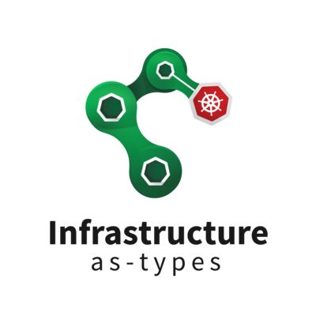

# Infrastructure as Types




Infrastructure as Types project provides tools for modern infrastructure declaration and deployment.
From simple application deployment script to a complex custom control plane, we'd like to help you write the code you need.

To prioritise our efforts, please feel free to give us feedback as to what do you think we should do next.

You can reach-out to us on GitHub or fill a [short anonymous form](https://forms.gle/bCtwi4ZFguAwdkru7).

## The Audience
We start our journey with an audience of:
- JVM developer teams
- At least medium Scala knowledge level
- Basic Cloud and Kubernetes skills

In **current stage**, we encourage only **experimental** usage.

## The Problem
With trends of moving complexity of non-functional requirements out of the application code,
and creating smaller and smaller micro or even nano-services (?),
we need tools to tackle the old and new complexity.

Main problems we want to solve:
- help **manage inherent complexity and avoid accidental complexity**
- address the definition scalability issues of hundreds of interdependent YAMLs
- allow for refactoring a lot safer than untyped, text heavy YAML
- effortless security rules, derived from the strongly typed code
- allow to tackle the complexity that comes with service mesh's and ingress controllers

## Vision

Use your programming language to express it all, business logic and non-functional requirements.

We want every JVM developer (starting with Scala) to **feel at home in a cloud native 
environment** (starting with Kubernetes). 

We believe that a **developer friendly** infrastructure abstractions are increasingly necessary in the age of the cloud.
Bootstrapping and maintaining a distributed system required by a modern business requirements is often challenging and costly.
Real-world use cases come with complexity that YAMLs ans JSONs can't reliably express. 
Strongly typed general purpose programming language, like Scala, is a game changer.

The plan for this PoC is simple, provide a set of tools for **micro-service infrastructure development**:
- High-level Scala DSL describing a **graph of your (micro)services and their connectivity**
- Low-level Scala DSL for Kubernetes manifest resources (incl. CRDs)
- YAML/JSON generators

Design considerations:
- easy to read and maintain code for the users
- 80% of use cases should be easy and straightforward to express (with high-to-mid-level abstractions)
- provide many extension points for the remaining 20% of use cases
- no unnecesary abstractions
- balance between type-safety and type-magic

Problem classes addressed:
- error-prone text based references between resources
- good defaults and examples lower the learning curve
- familiar tools and language lower the barriers to entry
- leverage the complexity management and refactoring abilities of Scala
- basic derivation of network policy rules from high-level definitions

We believe that with more work we could be able to do even more, especially with orchestrating kubernetes and a service mesh.

Additional opportunities and future development ideas:
- take advantage of Scala 3 unique features
- even thinner abstraction, more developer friendly
- deployment and release strategies library (blue-green, canary, A/B, etc.)
- unit and integrations test frameworks (with dry-run capabilities)
- control plane development library (e.g. for a service mesh)
- service-mesh specific features (e.g. xDS support for custom control planes)
- serverless library (e.g. support for Knative)
- sbt plugin and REPL e.g. Ammonite
- native container image support (e.g. GraalVM)
- self-deployment pattern support
- Kotlin support

## Kubernetes
The first backend we provide is the Kubernetes API.

Fragments of classic [GuestBook example](https://kubernetes.io/docs/tutorials/stateless-application/guestbook/) with added Network Policy:
```scala
val guestbook = Namespace(Name("guestbook") :: Nil)

val frontend = Application(
  Name("frontend") :: App("guestbook") :: Tier("frontend") :: Nil,
  Container(
    Name("php-redis") :: Nil,
    image = "gcr.io/google-samples/gb-frontend:v4",
    ports = TCP(80) :: Nil,
    envs = "GET_HOSTS_FROM" -> "dns" :: Nil
  ) :: Nil
)

val redisMaster = Application(
  Name("redis-master") :: App("redis") :: Role("master") :: Tier("backend") :: Nil,
  Container(
    Name("master") :: Nil,
    image = "k8s.gcr.io/redis:e2e",
    ports = TCP(6379) :: Nil
  ) :: Nil
)

import iat.kubernetes.dsl.NetworkPolicy.ops._

val connFrontRedis = frontend
  .communicatesWith(redisMaster)
  .egressOnly
  .labeled(Name("front-redis") :: App("guestbook") :: Nil)
val connFrontDns = frontend
  .communicatesWith(NetworkPolicy.peer.kubernetesDns)
  .egressOnly
  .named("front-k8s-dns")

import iat.skuber.deployment._
import skuber.json.format._

val ns: Seq[Summary] =
  guestbook.interpret.upsertBlocking().summary :: Nil
val apps: Seq[Summary] = List(
  redisMaster
    .interpretWith(guestbook)
    .map(redisMasterDetails),
  redisSlave
    .interpretWith(guestbook)
    .map(redisSlaveDetails),
  frontend
    .interpretWith(guestbook)
    .map(frontendDetails)
  ).flatMap(_.upsertBlocking().summary)

val conns: Seq[Summary] = List(
  NetworkPolicy.default.denyAll.interpretWith(guestbook),
  connExtFront.interpretWith(guestbook),
  connFrontRedis.interpretWith(guestbook),
  connRedisMS.interpretWith(guestbook),
  connRedisSM.interpretWith(guestbook),
  connFrontDns.interpretWith(guestbook),
  connRedisSlaveDns.interpretWith(guestbook)
).map(_.upsertBlocking().summary)
```

See the [full GuestBook example here](https://github.com/VirtusLab/infrastructure-as-types/blob/master/examples/src/main/scala/com.virtuslab.iat.examples/GuestBook.scala).
For a different flavour, see the [same applications but materialized into JSON/YAML](https://github.com/VirtusLab/infrastructure-as-types/blob/master/skuber/src/test/scala/com/virtuslab/iat/skubertest/SkuberGuestBookTest.scala).

## Core concepts
The basic concepts in the Infrastructure as Types high-level graphs are `Label`, `Protocol` and `Identity`,
and, of course, **types**.

### Label, protocol, identity
A label is a simple key/value pair. Can be used for grouping, selection or informational purposes.
```scala
trait Labeled {
  def labels: List[Label]
}

trait Label {
  def key: String
  def value: String
}
```

Protocols are stacked in `Layers`. For more details see `Protocol` and `Protocols`.
```scala
trait Protocol

object Protocol {
  trait Layer7 extends Protocol
  trait Layer4 extends Protocol
  trait Layer3 extends Protocol

  trait Layers[L7 <: Protocol.Layer7, L4 <: Protocol.Layer4, L3 <: Protocol.Layer3] {
    def l7: L7
    def l4: L4
    def l3: L3
  }

  trait IP extends Protocol.Layer3 with HasCidr
  trait UDP extends Protocol.Layer4 with HasPort
  trait TCP extends Protocol.Layer4 with HasPort

  trait HTTP extends Protocol.L7 {
    def method: HTTP.Method
    def path: HTTP.Path
    def host: HTTP.Host
  }
}
```

### Peer and Selection
Type, expressions, protocols and identities for a node of the connectivity graph.
Peer is a connectivity graph node that is instance of type `A`. 
Selection is a connectivity graph node of type `A` and no instance.

```scala
trait Peer[A] extends Reference[A] with Selection[A] { self: A =>
}

trait Selection[A] {
  def expressions: Expressions
  def protocols: Protocols
  def identities: Identities
}

trait Reference[A] { self: A =>
  def reference: A = self
}
```

### Extension points
There are many extension points provided to enable extension and customization.

#### Interpretable
The most important extension point is the `Interpretable` trait. 
It is a type that can be interpreted to some form of output. 
```scala
trait Interpretable[A] extends Reference[A] { self: A =>
}
```

`Interpretable[A]` types get their implementation specific 
methods from an `implicit class`, e.g.:
```scala
implicit class SecretInterpretationOps(val obj: Secret) 
  extends InterpreterOps1[Secret, Namespace, model.Secret]
```

It adds `interpretWith` method that take an implementation specific context `C` (`Namespace`)
and implicit function from `A` (`Secret`) and `C` to some `B1` (`model.Secret`).
```scala
trait InterpreterOps1[A, C, B1 <: Base] {
  def obj: Interpretable[A]
  def interpretWith(
      ctx: C
    )(implicit
      interpreter: (A, C) => B1
    ): B1 = interpreter(obj.reference, ctx)
}
```

See [core/InterpreterOps](https://github.com/VirtusLab/infrastructure-as-types/blob/master/core/src/main/scala/com/virtuslab/iat/core/InterpreterOps.scala)
for details.

The `Interpretable[A]` and `InterpreterOpsX` combined, give essentially the ability to go from a 
Kubernetes DSL `Secret` and `Namespace` to Kubernetes API `model.Secret`.

This mechanism gives the flexibility to:
- change the implementation (and the materialized output) with a simple `import`
- override the implicit interpreter at the `interpretWith` call-site
- easily implement a custom interpreter and use a type or only an instance

On the downside, it adds an abstraction layer, so we may remove it in the future
and scrafice generality for usability.

Moreover, the returned type `B1` extends an implementation specific `Base` type.
As a consequence, another `implicit class` can be added to the chain, e.g.:
```scala
type Base = ApiModel

implicit class ApiModelOps1[A <: Base](a: A) {
    def asJValues(implicit formats: Formats): List[JValue] = ???
}
```

This allows for interesting use cases, e.g.:
```scala
app                 // an application 'app'
  .interpret(ns)    // interpreted into a namespace 'ns'
  .map(appDetails)  // with a modified interpreter output (low level API)
  .upsertBlocking() // created or updated on a cluster
  .deinterpret      // de-interpreted back into high level API
  .summary          // summarize the difference between applied and defined 'app' 
```

#### Patchable
Patchable type is a simple convenience method to enable changes to the immutable types.
```scala
trait Patchable[A] { self: A =>
  def patch(f: A => A): A = f(self)
}
```

This is especially useful to express differences in the runtime environments (e.g. `dev` vs `prod`).

## Status

The project is in **alpha** and under heavy development, **any and all APIs can change without notice**.

| API/Technology | Status |
| -------------- | ------ |
| kubernetes     | alpha  |
| istio          | -      |
| linkerd        | -      |
| envoy          | -      |
| knative        | -      |

| Kubernetes Client | Status       |
| ----------------- | ------------ |
| skuber            | alpha        |
| OpenAPI / sttp    | experimental |

| Use case                   | Status       |
| -------------------------- | ------------ |
| JSON/YAML generation       | alpha        |
| Kubernetes Deployment      | experimental |
| JSON/YAML diff             | -            |
| Kubernetes Operator        | -            |
| Unit and integration tests | basic        |

## Community & Contribution

There is a dedicated channel `#infrastructure-as-types` on [virtuslab-oss.slack.com](https://virtuslab-oss.slack.com) ([Invite form](https://forms.gle/X3X8qA1XMirdBuEH7))

Feel free to file [issues](https://github.com/VirtusLab/infrastructure-as-types/issues) 
or [pull requests](https://github.com/VirtusLab/infrastructure-as-types/pulls).

**Before any big pull request** please consult the maintainers to ensure a common direction.

## Development

The project is a standard Scala/sbt project. Examples require a Kubernetes API access (`~/.kube/config`).

Test cluster config is available with (available only internally):
```bash
gcloud container clusters get-credentials standard-cluster-1 --zone us-central1-a --project infrastructure-as-types
```
